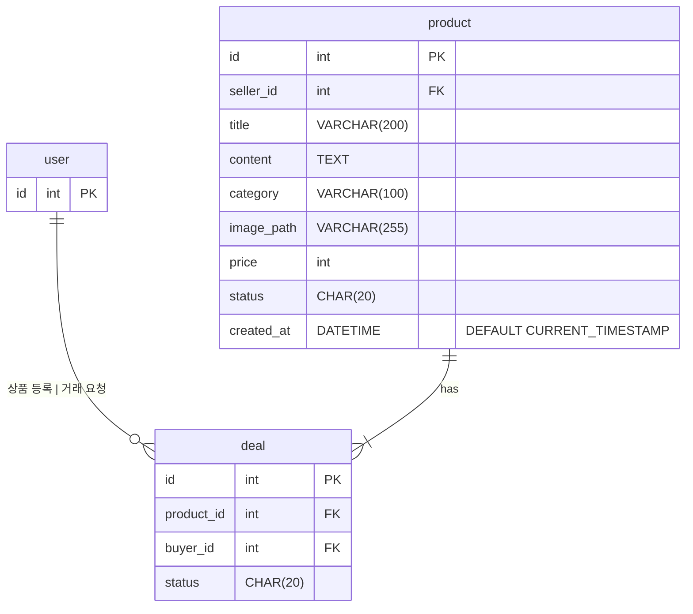

### product.status 상태 표

| 값 | 설명 | 비고 |
| --- | --- | --- |
| SELLING | 등록 직후 초기 상태 (판매 중) |  |
| RESERVED | 거래가 예약됨 |  |
| SOLD | 거래 요청을 승인하여 판매가 완료 |  |
|  |  | 현재 거래 취소는 기능 명세에 없음 |

### deal.status 상태 표

| 값 | 설명 | 비고 |
| --- | --- | --- |
| REQUESTED | 거래 요청됨 |  |
| APPROVED | 거래 수락됨 |  |

### 제약 조건

- 한 사용자는 하나의 상품에 동시에 하나의 거래 요청만 할 수 있음 (UK)